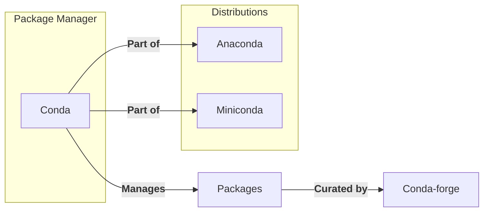

# Everything "Conda" Related

In this overview, we will clarify the terms related to Conda, a popular package and environment management system for Python and other programming languages. The terms covered include Conda, Conda-forge, Anaconda, Miniconda, and Conda-smithy.

## Conda

[Conda](https://conda.io/en/latest/) is an open-source, cross-platform package manager and environment management system. It simplifies the process of installing and managing packages, dependencies, and environments for various programming languages, including Python, R, and others. Conda allows users to create isolated environments with specific package versions, making it easier to work on multiple projects with different requirements.

## Anaconda

[Anaconda](https://www.anaconda.com/products/distribution) is a distribution of Python and R programming languages aimed at simplifying package management and deployment for data science applications. It includes Conda as its package and environment manager, along with a large number of pre-installed packages for scientific computing, data analysis, and machine learning. Anaconda provides a convenient way to get started with data science projects, as it contains most of the necessary tools and libraries.

## Miniconda

[Miniconda](https://docs.conda.io/en/latest/miniconda.html) is a minimal installer for Conda, providing only the Conda package manager and Python interpreter. It is a lightweight alternative to Anaconda, allowing users to create custom environments and install packages as needed. Miniconda is suitable for users who prefer a minimal setup and want to manage their packages and environments explicitly.

## Conda-forge

[Conda-forge](https://conda-forge.org/) is a community-driven repository of Conda packages, maintained by volunteers. It hosts a large number of packages built from open-source projects, providing an extensive collection of software that can be installed using the Conda package manager. Conda-forge packages are built using a consistent set of tools and practices, ensuring compatibility and reliability across different platforms.

[Conda-smithy](https://github.com/conda-forge/conda-smithy) is a tool for managing Conda-forge feedstocks, which are the source repositories used to build Conda packages. Conda-smithy automates the process of creating, updating, and maintaining feedstocks, making it easier for contributors to submit and maintain packages on Conda-forge. By using Conda-smithy, package maintainers can ensure that their packages are built consistently and conform to the best practices followed by the Conda-forge community.

## Summary
In summary, Conda is a package and environment manager, while Anaconda and Miniconda are distributions that include Conda. Conda-forge is a community-driven repository of Conda packages, and Conda-smithy is a tool for managing the feedstocks used to build those packages.

# TODO: Anaconda cloud, Anaconda Navigator