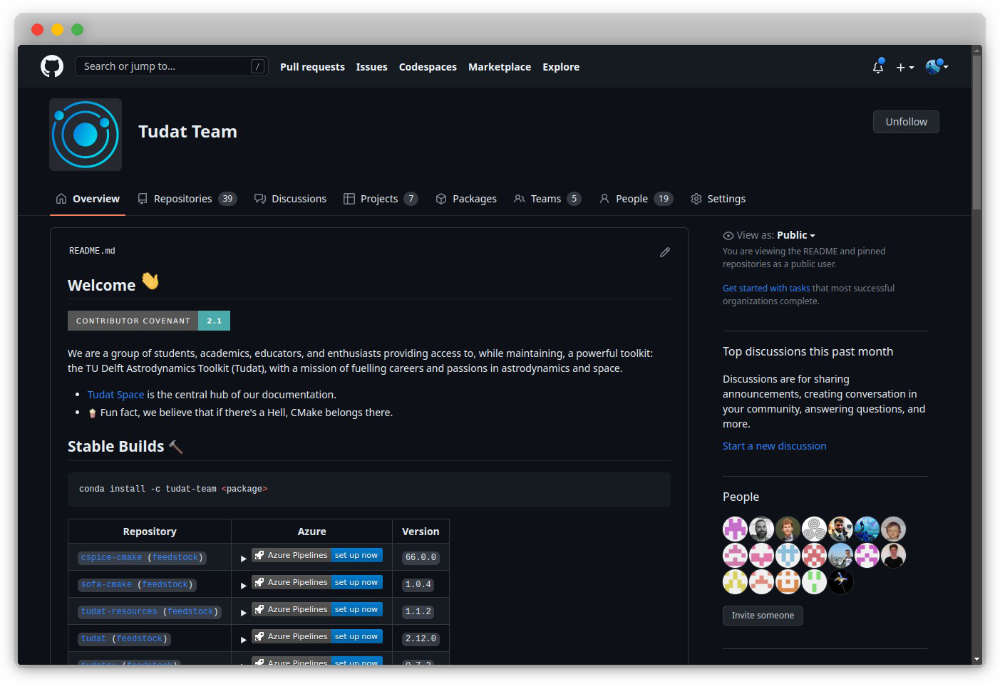

# GitHub in the Tudat Ecosystem
---

Welcome to the [`tudat-team` organization on GitHub](https://github.com/tudat-team)! The `tudat-team` uses GitHub as its primary Version Control System (VCS), project management tool, and platform for general feature discussions. The organization is dedicated to the development and maintenance of the tudat ecosystem, which aims to facilitate astrodynamics and space research. This overview introduces each repository in the `tudat-team` organization.

In addition to serving as our VCS, GitHub Actions are extensively used for DevOps within the `tudat-team`. More information on this can be found in other sections of the documentation.

## Our Repositories
---

### [`tudat-bundle`](https://github.com/tudat-team/tudat-bundle)
A developer's repository for the tudat environment. It bundles all dependencies maintained by the tudat-team, providing a familiar development environment.

### [`tudatpy`](https://github.com/tudat-team/tudatpy)
A Python platform for astrodynamics and space research. It brings the power of the tudat C++ libraries to Python.

### [`tudat`](https://github.com/tudat-team/tudat)
The core C++ platform for astrodynamics and space research. It offers a comprehensive set of libraries aimed at facilitating various aspects of space research.

### [`tudat-resources`](https://github.com/tudat-team/tudat-resources)
A resource manager repository for astrodynamics and space research. It separates data and resources from the main tudat library to ensure easy access and management.

### [`sofa-cmake`](https://github.com/tudat-team/sofa-cmake)
This repository contains the SOFA ANSI C source code, with additional cmake files to interface with tudat. It helps implement standard models used in fundamental astronomy.

### [`cspice-cmake`](https://github.com/tudat-team/cspice-cmake)
A repository containing the SPICE toolkits for C, with additional cmake files to interface with tudat. SPICE is a NASA observation geometry information system.

### [`nrlmsise-00-cmake`](https://github.com/tudat-team/nrlmsise-00-cmake)
This repository contains the NRLMSISE-00 Atmosphere Model in C, with additional cmake files to interface with tudat. It models the Earth's atmosphere's components and is used for various research purposes.

