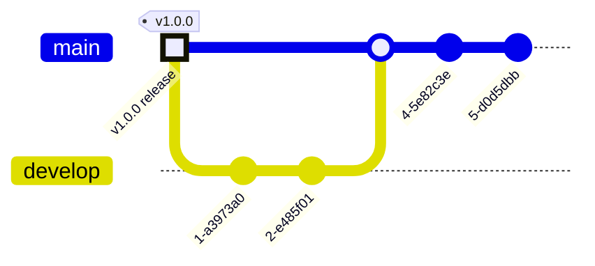

# GitFlow Workflow

!!! Guides
    For complete use case examples of these workflows, see 
    the following Tudat Developer Guides on Developer Workflows:

    - [Create a feature](/guides/create-feature.md)
    - [Create a bugfix](/guides/create-bugfix.md)
    - [Create a hotfix](/guides/create-hotfix.md)
    - [Create a release](/guides/create-release.md)

- Want to add a feature? See [Feature](#feature)
- Want to release a new stable version? See [Release](#release)
- Want to fix a non-critical bug? See [Bugfix](#bugfix)
- Want to fix a bug in a release? See [Hotfix](#hotfix)

## Develop



---

## Feature
---

```mermaid
%%{init: { 'logLevel': 'debug', 'theme': 'base', 'gitGraph': {'rotateCommitLabel': false}} }%%
ch
  commit tag: "v1.0.0"
  branch release/v1.1.0
  branch develop
  commit
  branch feature/feature1
  commit
  commit
  commit
  checkout develop
      commit
  branch feature/feature2
      commit id: "feat(api): ..."
      commit
  checkout develop
      merge feature/feature1
      merge feature/feature2
  commit
  checkout release/v1.1.0
  merge develop
  checkout main
  merge release/v1.1.0
  commit tag: "v1.1.0"

```


## Release

---

## Hotfix

---

## Bugfix

---

