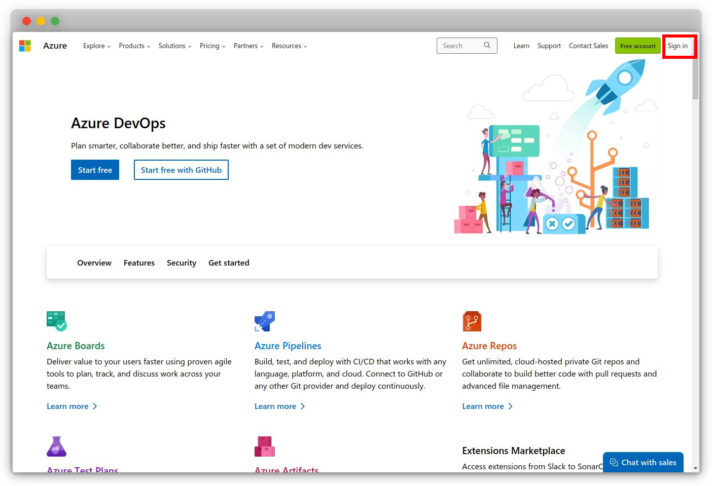
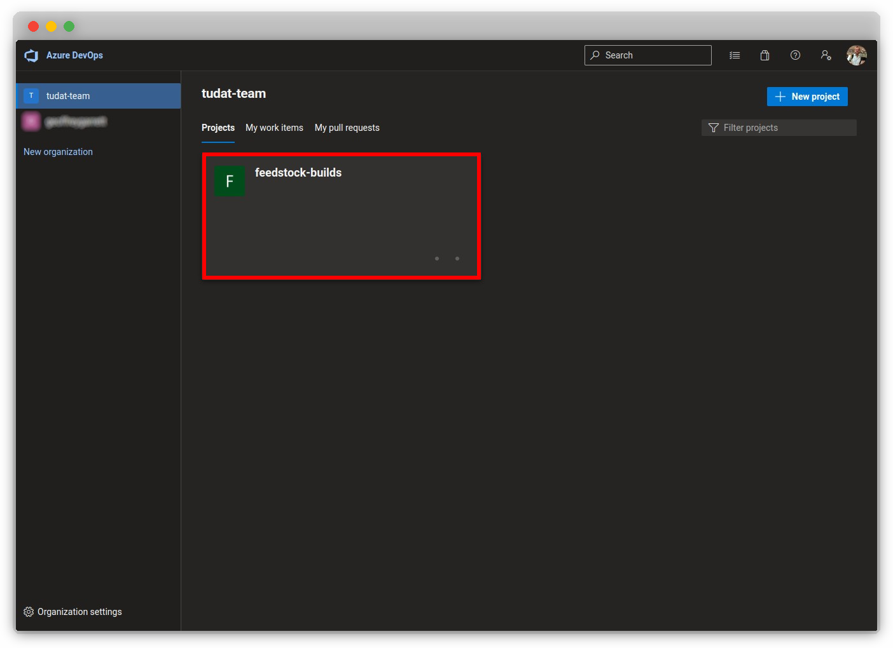
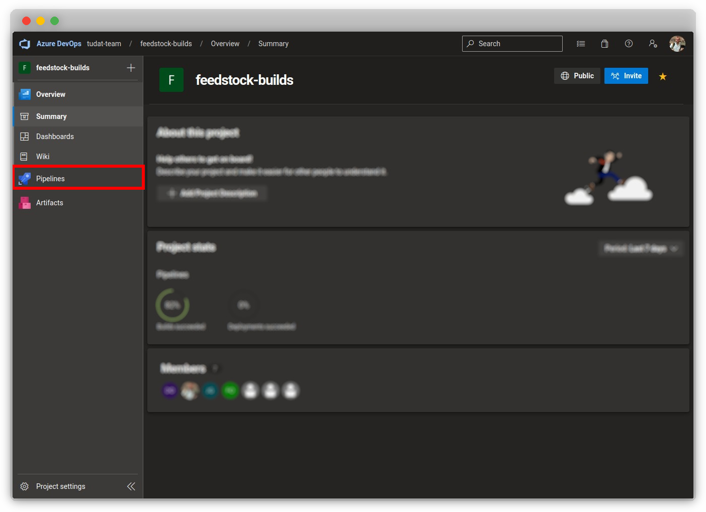
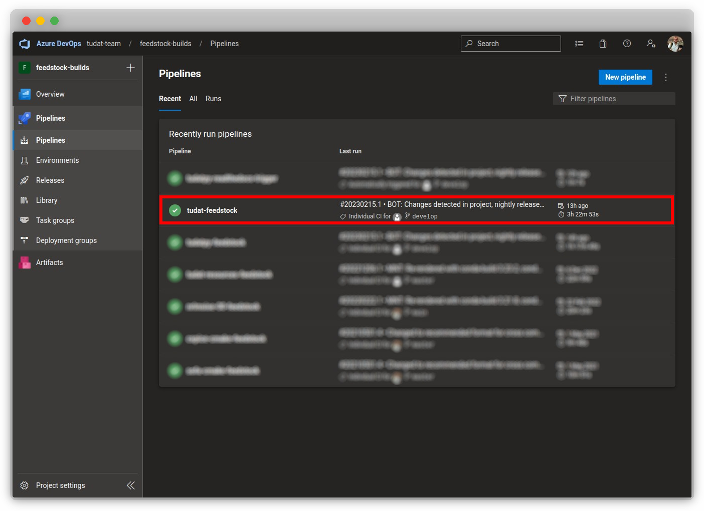
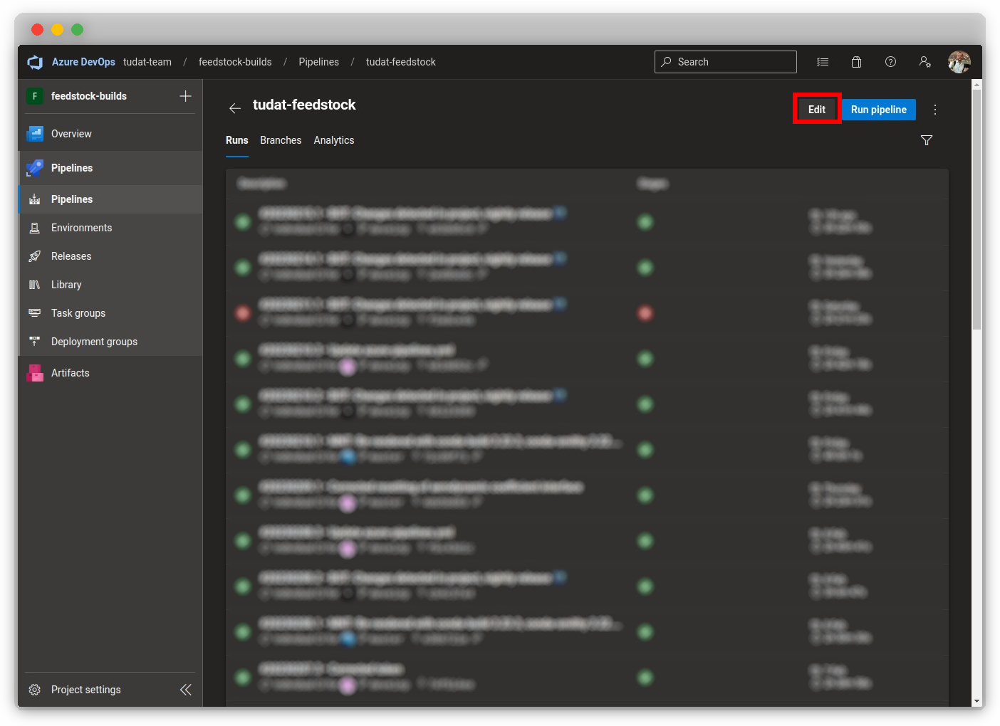
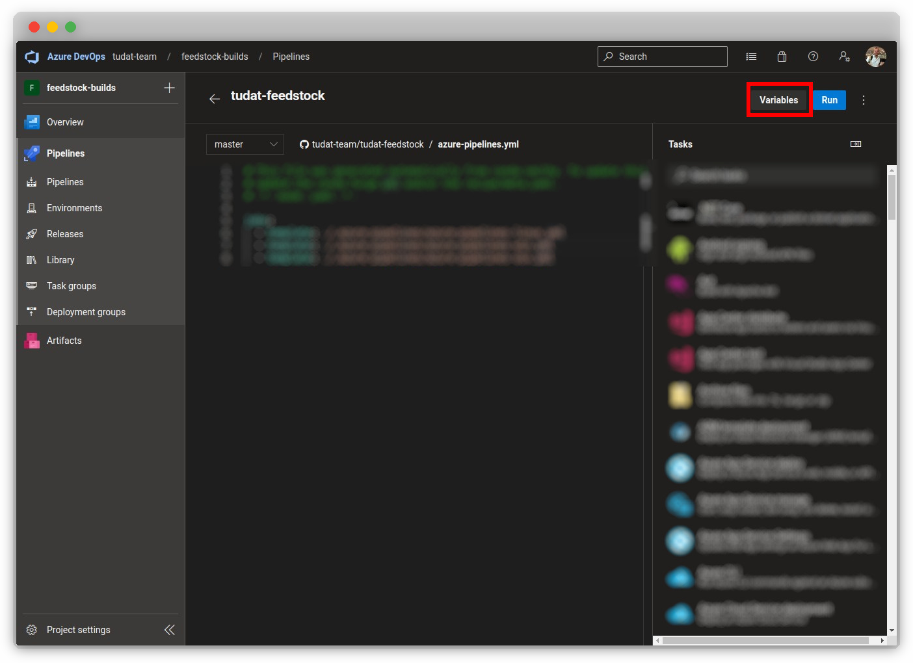
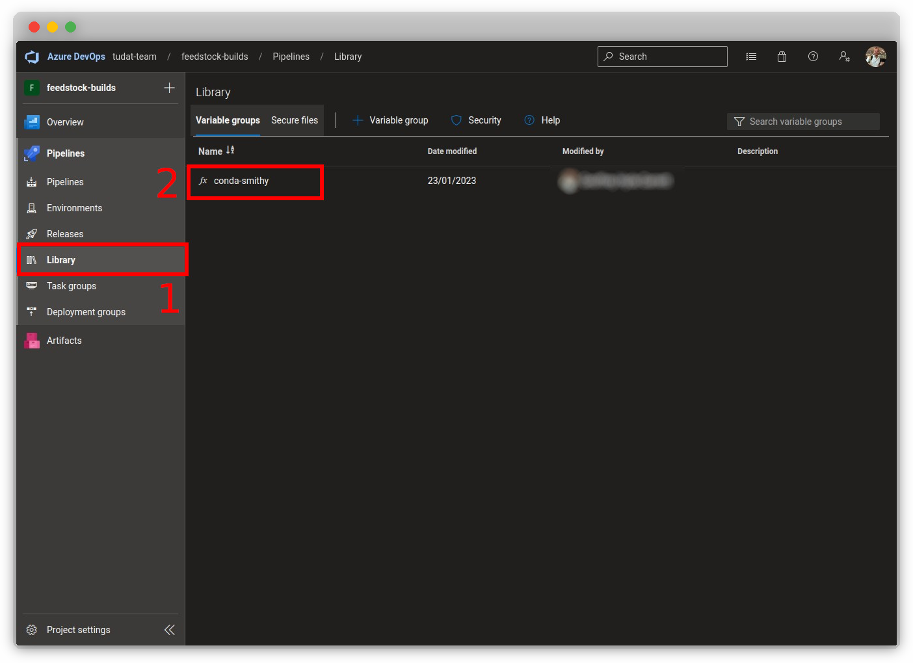
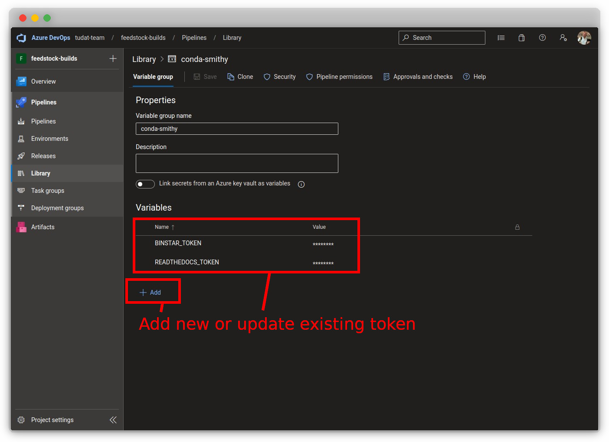

# Environment Variables

!!! note
      You are free to use any combination of setting and accessing environment
      variables that you prefer. You must just ensure that
      the environment variables are set before you run the script that uses them,
      and that the environment variables are accessible
      from the script that uses them.

## Python

---

### defined using `os.environ`

In Python, you can define environment variables using the `os.environ`
dictionary. The following code snippet demonstrates how to define an
environment variable named `VAR` in Python:

```python
import os

os.environ["VAR"] = "value"
```

!!! warning
      This is **not** a recommended way to define environment variables for
      sensitive information such as API keys. This method is not secure, as
      the environment variables are stored in plain text in the Python script.

### defined using `python-dotenv`

An alternative, more secure way to define environment variables in Python
is to use the `python-dotenv` library. This library allows you to define
environment variables in a `.env` file and load them into your Python
script.

1. Install the `python-dotenv` library using `pip`:

    ```bash
    pip install python-dotenv
    ```

2. Create a `.env` file in the same directory as your Python script and
   define the environment variables in the following format:

    ```bash
   
    VAR=value
    ```

3. Load the environment variables into your Python script using
   the `load_dotenv` function:

    ```python
    from dotenv import load_dotenv
    load_dotenv()
    ```

### retrieved using `os.environ.get`

Following the definition of environment variables, you can access them in
your Python script using the `os.environ.get` function.

```python
import os

my_variable = os.environ.get("VAR",
                             None)  # Returns None if VAR is not set
if my_variable:
    # Use my_variable in your script
    print("VAR is set to:", my_variable)
else:
    # VAR is not set, handle the error appropriately
    print("VAR is not set.")
```

## C++

---

### defined using `setenv`

In C++, you can define environment variables using the `setenv` function.

```cpp
#include <stdlib.h>

setenv("VAR", "value", 1);  // 1 indicates that the variable is overwritten if it already exists
                                    // 0 indicates that the variable is not overwritten if it already exists
```

### retrieved using `getenv`

Following the definition of environment variables, you can access them in
your C++ script using the `getenv` function.

```cpp  

#include <stdlib.h>

char* my_variable = getenv("VAR");

if (my_variable) {
    // Use my_variable in your script
    std::cout << "VAR is set to: " << my_variable << std::endl;
} else {
    // VAR is not set, handle the error appropriately
    std::cout << "VAR is not set." << std::endl;
}
```

## Unix (Linux, macOS)

---

### defined using `export`

In Unix-based systems, environment variables can be defined temporarily
in the current terminal session using the `export` keyword. This can also
be done within a Bash script (`.sh`).

```bash
export VAR="value"
```

### defined in `~/.bashrc`

In Unix-based systems, environment variables can be defined persistently
across terminal sessions by adding the `export` statements to your shell
profile file.

1. Open your shell profile file using a text editor (
   e.g. `nano ~/.bashrc`).
2. Add the `export` statements to the file (preferably at the end).
3. Save the file and close the text editor.
4. Restart your terminal session.
5. Verify that the environment variables are set by running the following
   command:

    ```bash
    env | grep VAR
    ```

!!! note
      If you are using **zsh**, you should use `~/.zshrc` instead of `~/.bashrc`.

### retrieved using `$VAR`

Following the definition of environment variables, you can access them in
your Bash script using the `$VAR` syntax.

```bash
if [ -n "$VAR" ]; then
    # Use $VAR in your script
    echo "VAR is set to: $VAR"
else
    # VAR is not set, handle the error appropriately
    echo "VAR is not set."
fi
```

## Windows

---

### defined using `set`

In Windows, environment variables can be defined temporarily in the
current terminal session using the `set` keyword. This can also be done
within a Batch script (`.bat`).

```batch
set VAR=value
```

### defined using `setx`

In Windows, environment variables can be defined persistently across
terminal sessions by adding the `setx` statements to your system
environment variables.

1. Open the "System Properties" window by pressing `Windows + Pause/Break`
   on your keyboard.
2. Click "Advanced system settings" on the left.
3. Click "Environment Variables" on the bottom right.
4. Click "New" under "System variables" and add the environment variables.
5. Click "OK" to save the changes.
6. Restart your terminal session.
7. Verify that the environment variables are set by running the following
   command:

    ```batch
    set | findstr VAR
    ```

### retrieved using <code>%VAR%</code>

Following the definition of environment variables, you can access them in
your Batch script using the `%VAR%` syntax.

```batch
if defined VAR (
    rem Use %VAR% in your script
    echo VAR is set to: %VAR%
) else (
    rem VAR is not set, handle the error appropriately
    echo VAR is not set.
)
```

## Azure Pipelines

---

!!! note
      This section is intended for maintainers of the feedstock repositories (at
      current). If you are not a maintainer, you can safely ignore this section.

1. Navigate to [`dev.azure.com`](https://dev.azure.com/) and sign in.

   

2. Click the `feedstock-builds` project under
   the [`tudat-team` organization](https://dev.azure.com/tudat-team).

   

### defined for a pipeline

1. After [navigating to the project](#navigate-to-the-project), click "
   Pipelines" under the `feedstock-builds` project.

   

2. Click on the specific pipeline in which you want to set the environment
   variable (e.g. `tudat-feedstock`).

   

3. Click "Edit" in the top-right of the page.

   

4. Click "Variables" in the top-right of the page.

   

5. Update an existing token (e.g. `BINSTAR_TOKEN`), or create a new one
   with the `+` icon.

   

   !!! note
       It is crucial to keep the environment variables private and secure.
       Ensure that you do not share them or commit them to a public repository,
       as this could lead to security issues.

### defined across all pipelines

!!! failure
      This section is the desired way of defining environment variables in
      Azure. However, it is currently not possible to define environment
      variables in an Azure project due to `conda-smithy` overwriting the
      `pipeline.yaml`. This is a known issue, and we are working on a solution.
      In the meantime, please use the method described in the previous section.
      This section therefore exists for future reference.

1. After [navigating to the project](#navigate-to-the-project), click "
   Library" under the `feedstock-builds` project and select the target "
   variable group".

   


2. Add a new variable by clicking `+ Add` or edit an existing one by
   clicking the name of value of the variable.

   

3. Make the variable group available by adding the following lines to
   the `pipeline.yaml` file in the root of the feedstock repository.

    ```yaml
    variables:
      - group: <variable_group_name>
    ```

   !!! note
       The `<variable_group_name>` should be the name of the variable group you
       created in step 1.

   !!! failure
       As mentioned, this will be overwritten by `conda-smithy`. It was
       expected that by adding:

        ```yaml
        azure:
           variables:
             - group: <variable_group_name>
        ```

        to the `conda-forge.yml` file, the `pipeline.yaml` would be updated accordingly, as [hinted at here](https://conda-forge.org/docs/maintainer/conda_forge_yml.html#azure). However, this is not the case. We are working on a solution.
