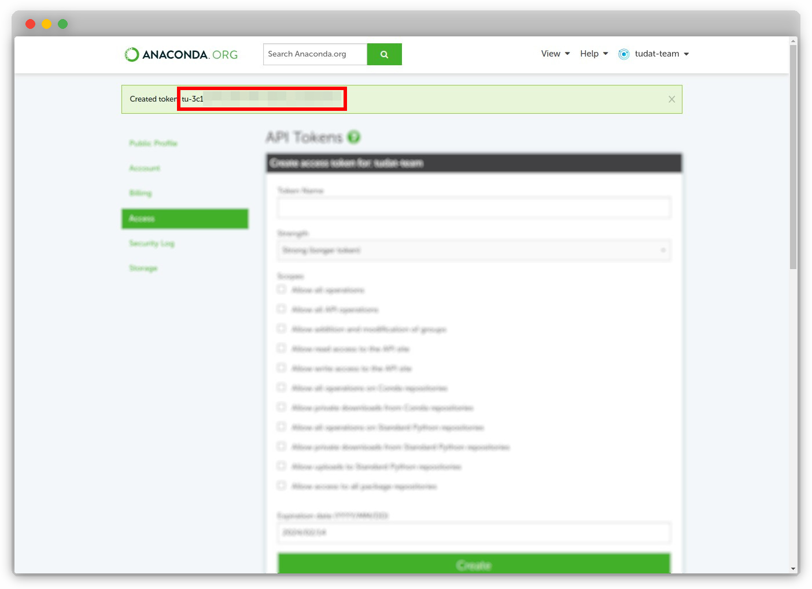
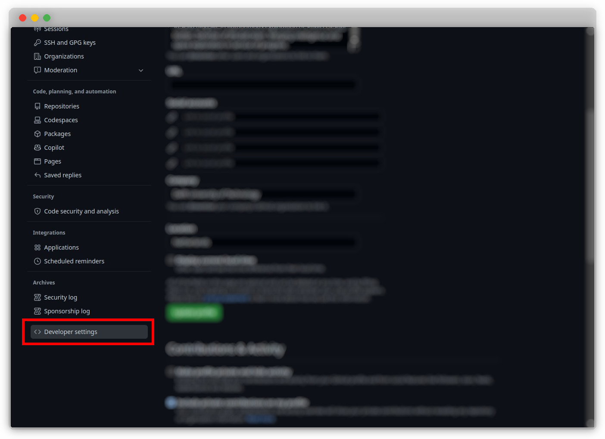

# Managing Access Tokens

An important part of the continuous integration (CI) process is the use 
of access tokens to authenticate the user to the relevant services.
This section describes how to generate access tokens for the following services:

- [Anaconda Cloud](https://anaconda.org)
- [GitHub](https://github.com)

## Generating Access Tokens

---

Access tokens are used to authenticate the user to the relevant service. 
The following sections describe how to generate access tokens for the following services:

### Organization Tokens on Anaconda Cloud

!!! note
    This section is intended for maintainers of the feedstock repositories (at current). If you are not a maintainer, you can safely ignore this section.

1. Navigate to https://anaconda.org/ and sign in.

    

2. Go to the organization page, for example, if the organization is named "tudat-team", the URL would be https://anaconda.org/tudat-team.

3. Click on the organization profile ("tudat-team") at the top-right of the page, followed by "Settings".

    

4. Fill in the details for creating a new token: name your token, provide the appropriate scope, and specify an expiration date. Then, click "Create".

    

5. The newly created organization token will be displayed. Copy the token and keep it safe, as it will only be shown once.

    

    !!! important 
        It is crucial to keep the organization token private and secure. Ensure that you do not share it or commit it to a public repository, as this could lead to security issues.

### User Tokens on GitHub

1. Navigate to [GitHub](https://github.com) and sign in.

    

2. Click on your profile picture at the top-right of the page to reveal a drop-down menu, select "Settings".

    

    !!! tip
        Dark mode makes you a better developer.

3. Click on "Developer settings".

    

4. Click on "Personal access tokens".

    

    !!! note
        Currently, we use the classic tokens. Any developer is free to use the new fine-grained tokens, which are in Beta at the time of writing the current documentation, so long as it works. That developer must just modify the documentation accordingly.

5. Click on "Generate new token (classic)".

    

    !!! important
        The correct selection of the scopes is pertinent to the continued operation of the dependent systems. This may influence one to over-scope the permissions, in order to avoid having to scrutinize the required ones to save time, however over-scoping is a bad practice and should be avoided, so as to avoid any malicious attempts.  See the documentation stating the required scopes from the relevant service.

6. Name your token, set an expiration time-delta, select the appropriate scopes, and finally click "Generate token".

    

7. Click on the copy icon provided, next to the token (or copy it yourself).

    

    !!! important
        It is important to never commit code with the token. If this is done, the token will be deactivated immediately, automatically in most cases by the relevant service. For example, if you commit a Github token to Github, it will be automatically deleted. This is a good safety feature to have, but if done with a token which multiple components in our system are dependent on, the amount of work to rectify this will be tedious and better avoided through taking mental note of this now.

## Storing Access Tokens

---

Access tokens should be stored in a secure manner, so that they are not 
exposed to the public. This is done by storing them as environment 
variables, which are not committed to the repository.

### Azure Pipelines

See [Environment Variables on Azure Pipelines](/guides/environment_variables/#azure-pipelines).